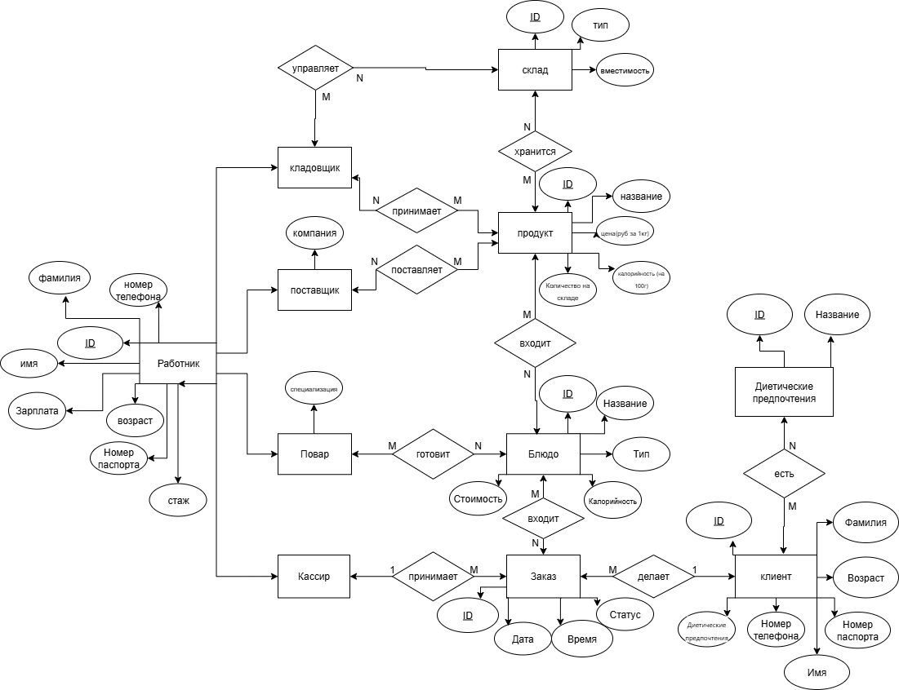
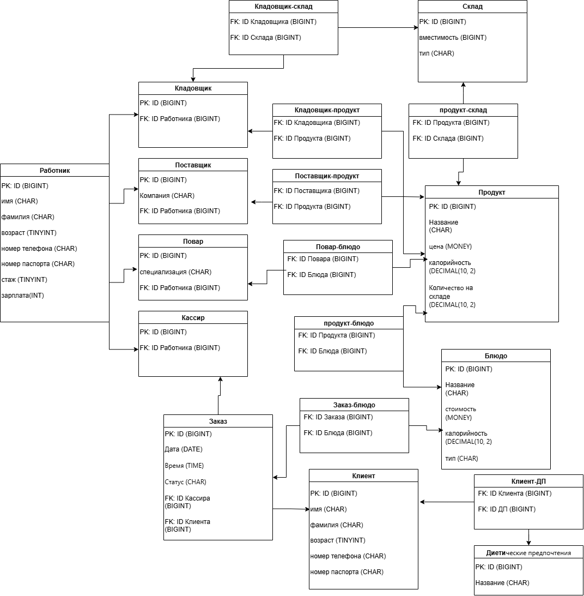

<h1 align="center">📊 Лабораторные по базам данных вариант 7</h1>

  

---

<h1 name="content" align="center">
   
  MSSQL
</h1>

   
  
  
  
  
   
  
  
   

#  Lab1
[Назад](#content)

<h3 align="center">

### ER-model:

### Relational model:

